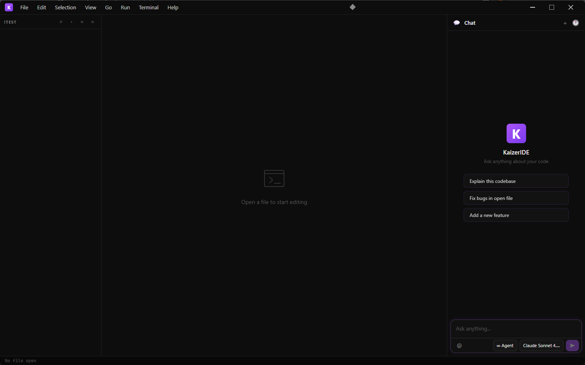

# KaizerIDE

<p align="center">
  
</p>

<p align="center">
  <strong>AI-Powered Desktop IDE</strong><br>
  A modern, lightweight code editor with integrated AI assistant
</p>

<p align="center">
  <a href="https://github.com/randheimer/KaizerIDE/releases"></a>
  <a href="https://github.com/randheimer/KaizerIDE/releases"></a>
  <a href="https://github.com/randheimer/KaizerIDE/stargazers"></a>
  <a href="https://github.com/randheimer/KaizerIDE/blob/main/docs/LICENSE"></a>
</p>

---

## ✨ Features

### 🤖 AI-Powered Coding Assistant
- **Context-Aware Chat** - AI understands your entire project structure
- **Tool Calling** - AI can read files, search code, and analyze your workspace
- **Multi-Model Support** - Works with any OpenAI-compatible API (Claude, GPT, local models)
- **Streaming Responses** - Real-time AI responses with syntax highlighting
- **Code Context Pills** - Attach files, folders, or selections to your prompts

### 💻 Modern Code Editor
- **Monaco Editor** - The same powerful editor from VS Code
- **Syntax Highlighting** - Support for 100+ programming languages
- **IntelliSense** - Auto-completion and intelligent code suggestions
- **Multi-Tab Editing** - Work on multiple files simultaneously
- **Minimap** - Quick navigation for large files
- **Customizable Themes** - Multiple editor themes including Kaizer Dark and Zero Syntax

### 📁 File Management
- **File Explorer** - Browse and manage your project files
- **Search Panel** - Fast file and text search across your workspace
- **Context Menu Integration** - Right-click files/folders in Windows Explorer to open in KaizerIDE
- **Drag & Drop** - Easy file operations

### 🎨 Beautiful UI/UX
- **macOS & Windows Themes** - Native-looking window controls for both platforms
- **Customizable Appearance** - Accent colors, compact mode, status bar toggle
- **Glassmorphism Design** - Modern frosted glass effects and smooth animations
- **Dark Mode** - Easy on the eyes for long coding sessions

### 🔧 Developer Tools
- **Integrated Terminal** - Run commands without leaving the IDE
- **Settings Panel** - Customize editor, appearance, and AI models
- **Keyboard Shortcuts** - Familiar shortcuts for productivity
- **Auto-Save** - Never lose your work

---

## 🚀 Quick Start

### Installation

1. **Download** the latest release from [GitHub Releases](https://github.com/randheimer/KaizerIDE/releases)
2. **Run** the installer (`KaizerIDE.Setup.x.x.x.exe`)
3. **Launch** from Start Menu or Desktop shortcut

### First Steps

1. **Open a Folder** - File → Open Folder or `Ctrl+O`
2. **Configure AI** - Settings → General → Set your API endpoint and key
3. **Start Coding** - Open files and use the AI assistant for help

---

## 🔐 Privacy & Security

**Your code stays on your machine.**

- ✅ **No Telemetry** - Zero data collection, analytics, or tracking
- ✅ **No Account Required** - Use completely offline (except AI API calls)
- ✅ **Local Storage** - All settings and data stored on your device
- ✅ **Open Source** - Audit the code yourself
- ✅ **Your API Keys** - Stored locally, never sent to our servers

**AI Privacy:**
- AI requests go directly to YOUR chosen API endpoint
- We never see your code or prompts
- Use local models for complete privacy

---

## ⚙️ Configuration

### AI Setup

1. Open Settings (`Ctrl+,`)
2. Go to **General** tab
3. Set your **Endpoint URL** (e.g., `http://localhost:20128/v1`)
4. Add your **API Key** (optional, depends on your provider)

### Supported AI Providers

- **OpenAI** - GPT-4, GPT-3.5
- **Anthropic Claude** - Via OpenAI-compatible proxy
- **Local Models** - Ollama, LM Studio, LocalAI
- **Custom Endpoints** - Any OpenAI-compatible API

### Editor Customization

**Settings → Editor:**
- Font size, family, and cursor style
- Tab size and word wrap
- Minimap and line numbers
- Auto-save options
- Bracket colorization

**Settings → Appearance:**
- Window controls theme (macOS/Windows)
- Accent color
- Compact mode
- Status bar visibility

---

## 🎯 Use Cases

### For Developers
- Quick prototyping with AI assistance
- Code review and refactoring
- Learning new languages and frameworks
- Debugging with AI help

### For Students
- Learning to code with AI tutor
- Homework and project assistance
- Understanding complex concepts
- Free and open-source

### For Teams
- Lightweight alternative to heavy IDEs
- Self-hosted AI for privacy
- Customizable for team workflows
- No subscription fees

---

## 🛠️ Tech Stack

- **Electron** - Cross-platform desktop framework
- **React** - UI framework
- **Vite** - Fast build tool
- **Monaco Editor** - VS Code's editor
- **Node-PTY** - Terminal emulation
- **Chokidar** - File watching

---

## 📦 Building from Source

### Prerequisites
- Node.js 20+
- npm or yarn
- Windows (for Windows builds)

### Development

```bash
# Clone the repository
git clone https://github.com/randheimer/KaizerIDE.git
cd KaizerIDE

# Install dependencies
npm install

# Run in development mode
npm run dev

# Build for production
npm run build
npm run electron:build
```

---

## 🤝 Contributing

We welcome contributions! See [CONTRIBUTING.md](CONTRIBUTING.md) for guidelines.

### Ways to Contribute
- 🐛 Report bugs
- 💡 Suggest features
- 📝 Improve documentation
- 🔧 Submit pull requests
- ⭐ Star the project

---

## 📝 License

KaizerIDE is open-source software licensed under a [Custom License](LICENSE).

**Key Points:**
- ✅ Free to use and modify
- ✅ Must include attribution to original author
- ❌ Commercial use requires permission
- ✅ Open source with restrictions

---

## 🔗 Links

- [GitHub Repository](https://github.com/randheimer/KaizerIDE)
- [Report a Bug](https://github.com/randheimer/KaizerIDE/issues/new?labels=bug)
- [Request a Feature](https://github.com/randheimer/KaizerIDE/issues/new?labels=enhancement)
- [Releases](https://github.com/randheimer/KaizerIDE/releases)

---

## 💬 Support

Need help? Have questions?

- 📖 Check the [documentation](https://github.com/randheimer/KaizerIDE#readme)
- 🐛 [Open an issue](https://github.com/randheimer/KaizerIDE/issues)
- ⭐ Star the project if you find it useful!

---

<p align="center">
  Made with ❤️ by the KaizerIDE team
</p>

<p align="center">
  <sub>Built for developers who value privacy, speed, and AI assistance</sub>
</p>
- We never see your code or prompts
- Use local models (Ollama, LM Studio) for complete offline privacy

## 🎯 Features

- 🎨 **Monaco Editor** - VS Code's powerful editor with syntax highlighting
- 🤖 **AI Chat Assistant** - Context-aware coding help with tool calling
- 📁 **File Explorer** - Navigate projects with ease
- 🔍 **Search & Replace** - Fast full-text search across files
- 💻 **Integrated Terminal** - Run commands without leaving the IDE
- 🎯 **Multi-file Context** - Attach files/folders to AI conversations
- 🔄 **Auto-updates** - Stay up to date automatically
- 🪟 **Windows Context Menu** - Right-click files/folders to open in KaizerIDE

## 📥 Download & Installation

Download the latest version from the [Releases](https://github.com/randheimer/KaizerIDE/releases) page.

**Windows:**
1. Download `KaizerIDE-Setup-x.x.x.exe`
2. Run the installer
3. Launch from Start Menu or Desktop

**Supported AI Providers:**
- [OpenRouter](https://openrouter.ai/) - Access 100+ models
- [Ollama](https://ollama.ai/) - Run models locally
- [LM Studio](https://lmstudio.ai/) - Local model hosting
- OpenAI API or any OpenAI-compatible endpoint

## 🚀 Quick Start

1. **Open a Project** - File → Open Folder or right-click any folder in Windows Explorer
2. **Configure AI** - Click settings → Add your API endpoint and key
3. **Start Coding** - Use the AI chat to ask questions, generate code, or debug

## 💻 Development

### Prerequisites
- Node.js 20+
- npm

### Setup
```bash
git clone https://github.com/randheimer/KaizerIDE.git
cd KaizerIDE
npm install
npm run dev
```

### Build
```bash
npm run build          # Build Vite app
npm run electron:build # Build Windows installer
```

## 🛠️ Tech Stack

- **Electron** - Desktop framework
- **React** - UI library
- **Vite** - Build tool
- **Monaco Editor** - Code editor (VS Code's editor)
- **React Markdown** - Markdown rendering

## 🤝 Contributing

We welcome contributions! See [CONTRIBUTING.md](CONTRIBUTING.md) for guidelines.

**Good First Issues:** Look for issues labeled `good first issue` to get started!

## 📝 License

Custom License - Free to use and modify with attribution. See [LICENSE](LICENSE) for details.

## 🌟 Show Your Support

If you like KaizerIDE, give it a ⭐️ on GitHub!

## 📧 Support

- 🐛 [Report a bug](https://github.com/randheimer/KaizerIDE/issues/new?labels=bug)
- 💡 [Request a feature](https://github.com/randheimer/KaizerIDE/issues/new?labels=enhancement)
- 💬 [Ask a question](https://github.com/randheimer/KaizerIDE/discussions)

---

<p align="center">Made with ❤️ by <a href="https://github.com/randheimer">Randheimer</a></p>
