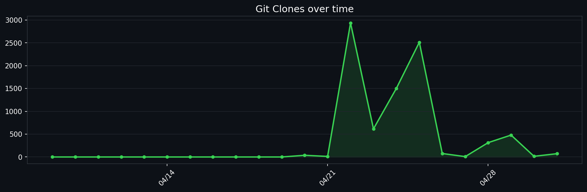

  

<h1 align="center">KaizerIDE</h1>

  <strong>AI-Powered Desktop IDE — local-first, zero telemetry, direct API control</strong>

  
  
  
  

  <a href="https://github.com/randheimer/KaizerIDE/releases"><strong>⬇️ &nbsp;Download for Windows</strong></a>
  ·
  <a href="QUICK_START.md"><strong>Quick Start</strong></a>
  ·
  <a href="FEATURES.md"><strong>Features</strong></a>
  ·
  <a href="PRIVACY.md"><strong>Privacy</strong></a>

  

---

## What is KaizerIDE?

KaizerIDE is a lightweight desktop IDE that pairs a full Monaco code editor with a multi-agent AI assistant — and keeps everything under your control. No telemetry, no required account. AI requests go directly to the endpoint you configure, including local models running on your own machine.

It ships with **local workspace indexing** so the AI understands your entire codebase instantly, without cloud embeddings or external services.

## Why KaizerIDE?

| You want | KaizerIDE gives you |
| --- | --- |
| **AI without lock-in** | Bring any OpenAI-compatible endpoint, hosted or local. |
| **Privacy by default** | No telemetry, no required account, no KaizerIDE AI proxy. |
| **A real editor** | Monaco-powered editing with tabs, IntelliSense, minimap, autosave, and syntax highlighting. |
| **Workspace-aware help** | Local indexing, file context, selection context, and agent modes built for real codebases. |
| **A lightweight desktop workflow** | File explorer, terminal, command palette, settings, SSH/SFTP, and Windows integration. |

---

## Choose your path

| If you want to... | Go here |
| --- | --- |
| Install and set up KaizerIDE for the first time | **[Quick Start](QUICK_START.md)** |
| Configure AI endpoints, appearance, editor behavior, or indexing | **[Configuration](CONFIGURATION.md)** |
| Understand the main product areas | **[Features](FEATURES.md)** |
| See how local-first AI and indexing work | **[Privacy](PRIVACY.md)** |
| Build or modify the app from source | **[Building from Source](BUILDING.md)** |

---

## Features

<table>
  <tr>
    <td width="50%" valign="top">
      <h3>🤖 Multi-Agent AI</h3>
      Four specialized modes — <strong>Agent</strong>, <strong>Planner</strong>, <strong>Ask</strong>, and <strong>Fixer</strong> — each with distinct tool access and behavior. Context pills attach files and selections without pasting.
    </td>
    <td width="50%" valign="top">
      <h3>💻 Monaco Editor</h3>
      The same editor core as VS Code — multi-tab editing, syntax highlighting for 100+ languages, IntelliSense, minimap, bracket colorization, and autosave.
    </td>
  </tr>
  <tr>
    <td valign="top">
      <h3>🔍 Local Workspace Indexing</h3>
      Indexes your entire codebase on open. Symbol extraction, fuzzy search, real-time file watching — 100% on-device, no cloud embeddings.
    </td>
    <td valign="top">
      <h3>⚡ Command Palette</h3>
      <code>Ctrl+Shift+P</code> — keyboard-first access to every IDE action. New file, save, toggle sidebar, settings, reindex, SSH connect, and more.
    </td>
  </tr>
  <tr>
    <td valign="top">
      <h3>🔐 Privacy-First Design</h3>
      Zero telemetry. No required account. Direct API routing — your AI requests never pass through a KaizerIDE proxy. Works fully offline with local models.
    </td>
    <td valign="top">
      <h3>🌐 SSH / SFTP Support</h3>
      Connect to remote servers and edit files directly from the IDE. Windows Explorer context-menu integration to open any folder in KaizerIDE.
    </td>
  </tr>
  <tr>
    <td valign="top">
      <h3>🎨 Modern UI</h3>
      Glassmorphism surfaces, accent color controls, compact mode, macOS and Windows window chrome themes, lazy-loaded modals for fast startup.
    </td>
    <td valign="top">
      <h3>🔧 Developer Tools</h3>
      Integrated terminal, settings panel, keyboard shortcuts, <code>.gitignore</code>-aware async file tree, and ESLint + Prettier quality tooling.
    </td>
  </tr>
</table>

---

## Screenshots

<table>
  <tr>
    <td align="center"></td>
    <td align="center"></td>
    <td align="center"></td>
  </tr>
  <tr>
    <td align="center"></td>
    <td align="center"></td>
    <td align="center"></td>
  </tr>
</table>

  <a href="SCREENSHOTS.md">View all screenshots →</a>

---

## Quick install

  <a href="https://github.com/randheimer/KaizerIDE/releases"><strong>⬇️ &nbsp;Download the latest release from GitHub Releases</strong></a>

1. Run `KaizerIDE-X.Y.Z.exe`.
2. Open a folder with `Ctrl+O`.
3. Configure your AI endpoint in **Settings → General**.
4. Press `Ctrl+Shift+P` and start coding.

Optionally verify the SHA256 checksum shipped with each release. See the full **[Quick Start](QUICK_START.md)** for the complete first-run flow.

---

## Roadmap

| Milestone | Status |
| --- | --- |
| Core IDE — editor, tabs, file explorer, terminal | ✅ Complete |
| Multi-agent AI system (Agent / Planner / Ask / Fixer) | ✅ Complete |
| Local workspace indexing with real-time file watching | ✅ Complete |
| Command palette, durable sessions, ESLint + Prettier | ✅ Complete |
| Git UI — visual diff and commit history | ✅ Complete |
| Debugger integration | 📋 Planned |
| Custom themes and color schemes | 📋 Planned |
| Documentation generation from code | 📋 Planned |

---

## Documentation hub

| Guide | Best for |
| --- | --- |
| **[Quick Start](QUICK_START.md)** | First install, first folder, first AI setup, and core shortcuts. |
| **[Configuration](CONFIGURATION.md)** | AI providers, editor preferences, appearance options, and indexing behavior. |
| **[Features](FEATURES.md)** | A product overview with links into every feature area. |
| **[Privacy](PRIVACY.md)** | Local-first guarantees, AI request routing, and workspace indexing behavior. |
| **[Trust & Positioning](TRUST.md)** | How KaizerIDE compares with other IDEs and what the trust model promises. |
| **[Building from Source](BUILDING.md)** | Local development, release builds, linting, formatting, and packaging. |

---

## Feature guides

| Guide | Covers |
| --- | --- |
| **[AI Assistant](features/AI_ASSISTANT.md)** | Multi-agent chat, context pills, tool calling, planning, streaming, durable sessions, and providers. |
| **[Editor](features/EDITOR.md)** | Monaco editing, tabs, syntax highlighting, IntelliSense, minimap, themes, and autosave. |
| **[File Management](features/FILE_MANAGEMENT.md)** | File explorer, search, `.gitignore` awareness, SSH/SFTP, context menus, and drag/drop. |
| **[UI & UX](features/UI_UX.md)** | Welcome screen, command palette, themes, appearance controls, glass effects, and lazy-loaded modals. |
| **[Developer Tools](features/DEVELOPER_TOOLS.md)** | Terminal, settings, shortcuts, workspace indexer pointers, and quality workflows. |
| **[Workspace Indexing](features/INDEXING.md)** | Local indexing, symbol extraction, search tools, cache behavior, performance, and troubleshooting. |

---

## Repository stats

---

## Project resources

| Resource | Link |
| --- | --- |
| **GitHub repository** | [randheimer/KaizerIDE](https://github.com/randheimer/KaizerIDE) |
| **Releases** | [Download builds](https://github.com/randheimer/KaizerIDE/releases) |
| **Bug reports** | [Open a bug issue](https://github.com/randheimer/KaizerIDE/issues/new?labels=bug) |
| **Feature requests** | [Request a feature](https://github.com/randheimer/KaizerIDE/issues/new?labels=enhancement) |
| **Contributing** | [Contribution guide](CONTRIBUTING.md) |
| **Security** | [Security policy](SECURITY.md) |
| **License** | [Custom License](LICENSE) |

---

## Support

- **Documentation** — Start with this hub and follow the topic links above.
- **Issues** — Use [GitHub Issues](https://github.com/randheimer/KaizerIDE/issues) for bugs and requests.
- **Community** — Star the project if KaizerIDE is useful to you.

---

  

  Made with ❤️ by the KaizerIDE team

  Built for developers who value privacy, speed, and AI assistance

